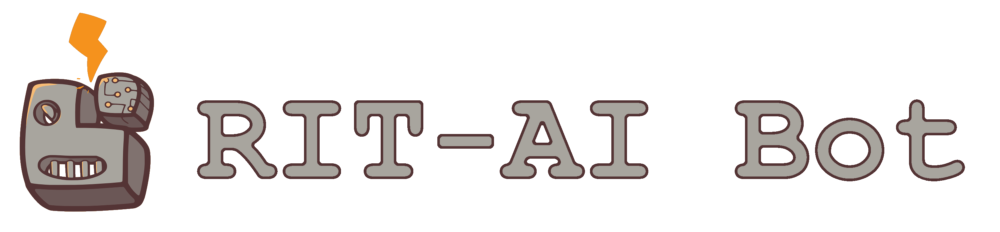

# RIT-AI Bot

This is code to run a Slackbot for the RITficial Intelligence club at RIT. If you would like to run it, you will need the Bot User Secret, which the Eboard should be able to locate for you.

## Installation

Install requirements.

```
pip install -r requirements.txt
```

Create a .sh file with these three lines:

```
export APP_ACCESS_TOKEN='<app_secret>'
export APP_BOT_USER_TOKEN='<bot_user_secret>'
python3 bot/bot.py
```

Then, you can run this file using the command:

```
./bot.sh
```

It runs continuously. So far it has access to these commands, all prepended with @ritai:

* `mnist <image>` -- guesses the number in an image
* `kmeans [k_value] <image>` -- applies color simplification to an image via k-means clustering
* `stylize [style] <image>` -- applies neural style transfer to an image
